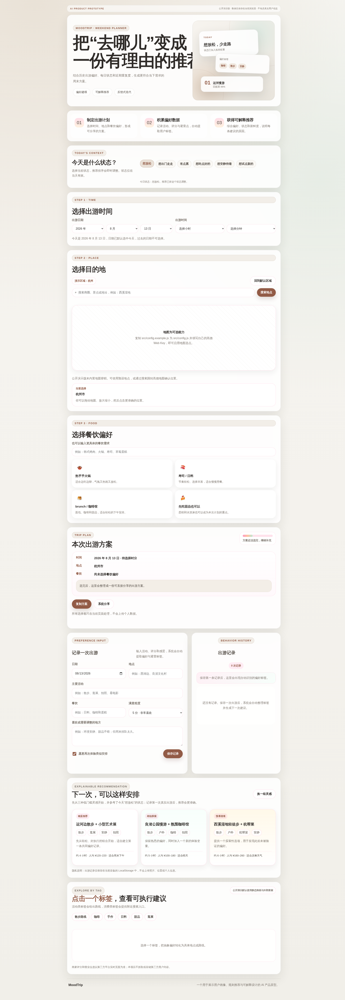

# MoodTrip

> 基于历史偏好与每日状态的个性化周末出游推荐助手。

[](https://developer.mozilla.org/zh-CN/docs/Web/JavaScript)
[](https://pages.github.com/)
[](./LICENSE)

MoodTrip 是一个面向朋友、情侣和出游搭子的轻量决策原型。它把历史出游记录转化为偏好标签，再结合当天状态、近期重复度和新鲜度，对候选方案进行排序，并解释“为什么推荐”。


## 在线体验

[在线体验 MoodTrip](https://ad28add29405.aime-app.bytedance.net)



公开演示版不内置第三方 API 密钥，因此地图属于可选能力；时间选择、偏好记录、每日状态、推荐和外部搜索入口均可独立使用。

将仓库发布到 GitHub Pages 后，也可以使用 `https://<your-username>.github.io/moodtrip-ai-planner/` 作为长期作品集地址。

## 产品背景

周末出游的核心困难通常不是信息不足，而是选择成本过高。攻略平台能提供大量地点，却很难同时理解用户过去喜欢什么、最近去过哪里、今天有多少体力，以及为什么某个方案更合适。

MoodTrip 将决策拆成“记录—建模—推荐—解释—探索”五个环节。用户记录真实体验后，系统识别高频偏好和避雷项；推荐阶段再加入每日状态、新鲜度与重复惩罚，生成稳妥推荐、相似探索和惊喜选项三个方向。

## 核心功能

| 模块 | 用户价值 | 产品能力 |
| --- | --- | --- |
| 每日状态 | 表达当下体力和意愿 | 实时上下文建模 |
| 出游记录 | 沉淀地点、活动、餐饮和评价 | 行为数据结构化 |
| 自动标签 | 从自然语言中识别偏好与避雷项 | 轻量用户画像 |
| 个性化排序 | 平衡偏好、新鲜度和近期重复 | 可审计推荐策略 |
| 推荐解释 | 展示命中偏好和调整原因 | 可解释性设计 |
| 标签探索 | 将抽象偏好转化为路线或平台搜索 | 决策到行动闭环 |

## 推荐策略

当前原型使用透明的规则评分，方便在没有后端和模型成本的情况下验证产品流程：

```text
推荐分数 = 历史偏好匹配 × 3
         + 每日状态匹配 × 5
         + 新鲜标签 × 2
         - 近期重复标签 × 2
```

历史记录的评分越高、且用户愿意再次体验，对应标签权重越高。系统不会只给一个“最优答案”，而是刻意输出稳妥、相似探索和惊喜三个不同方向，降低推荐单一化。

详细说明见 [推荐与评测设计](./docs/evaluation.md)。

## 快速开始

无需安装依赖，克隆仓库后直接打开 `index.html`，或使用任意静态服务器运行：

```bash
git clone https://github.com/<your-username>/moodtrip-ai-planner.git
cd moodtrip-ai-planner
python3 -m http.server 8080
```

浏览器访问 `http://localhost:8080`。

### 可选：启用高德地图

公开仓库不应提交真实 Key。申请高德 Web 端 JS API Key 后，编辑 `src/config.js`：

```js
window.MOODTRIP_CONFIG = {
  amapKey: 'YOUR_AMAP_WEB_KEY',
};
```

建议为 Key 设置域名白名单和调用限制。若不配置，产品会显示静态占位并保留预设地点、路线和第三方搜索入口。

## 项目结构

```text
moodtrip-ai-planner/
├── assets/
│   ├── images/                 # 产品截图
│   └── styles/main.css         # 页面样式
├── docs/
│   ├── prd.md                  # 产品需求说明
│   ├── evaluation.md           # 推荐与评测方案
│   └── iteration-log.md        # 关键迭代记录
├── src/
│   ├── app.js                  # 日期、地点、餐饮与分享
│   ├── config.js               # 公开安全配置
│   ├── config.example.js       # 第三方能力配置示例
│   ├── discovery.js            # 标签路线与商家探索
│   ├── memory.js               # 记录、标签与推荐排序
│   └── mood.js                 # 每日状态
├── test-data/
│   └── evaluation-cases.csv    # 人工评测用例
├── .gitignore
├── .nojekyll
├── index.html
├── LICENSE
└── README.md
```

## 数据与隐私

项目不包含真实用户姓名、私人照片、历史足迹或可用的 API Key。用户输入只保存在当前浏览器的 LocalStorage 中，刷新页面不会丢失，但不会上传到服务器。公开设备使用后可通过浏览器设置清除站点数据。

外部平台链接只负责打开搜索结果页；本项目不抓取、不复制，也不存储第三方平台的用户内容、评分或帖子。

## 产品验证

仓库提供了 10 条基础评测场景，覆盖每日状态、历史偏好、避雷项和近期重复。建议每轮修改后，从相关性、约束满足、解释一致性和多样性四个维度进行人工评分，并记录失败案例，而不是只展示成功 Demo。

## 迭代路线

下一阶段重点是补齐真正的反馈闭环：为推荐增加“感兴趣、不合适、去过了、收藏”操作；将反馈转化为偏好权重；增加预算、距离、天气等硬约束；建立 30 条以上的固定评测集；最后再对比规则推荐与 LLM 生成方案的效果、成本和稳定性。

## 我的工作

该项目覆盖了从真实问题发现到可运行原型的完整流程，包括产品定义、信息架构、交互设计、推荐规则、前端实现、隐私清理、评测用例和版本迭代。完整需求与取舍见 [产品需求说明](./docs/prd.md)，关键变化见 [迭代记录](./docs/iteration-log.md)。

## License

本项目基于 [MIT License](./LICENSE) 开源。
